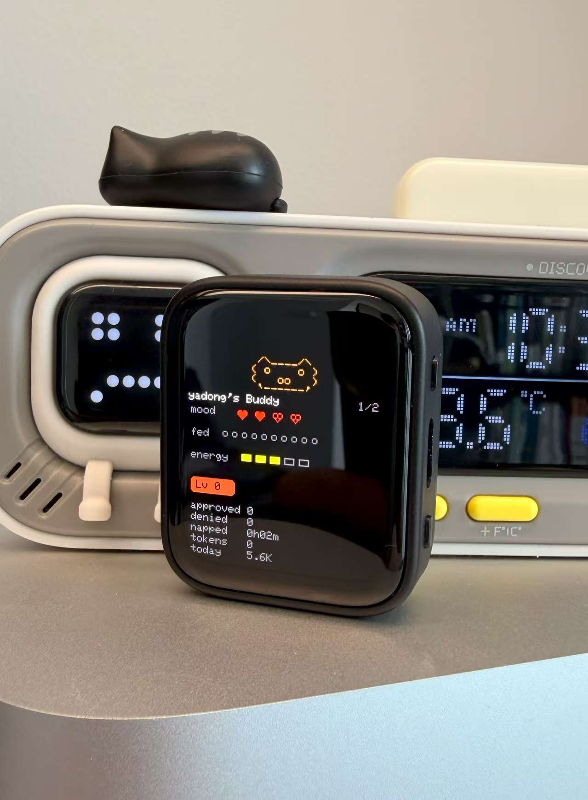

# 🎂 Buon compleanno bro! 🎉

## claudioscar-buddy

A desk buddy for **Claude Code / Claude Cowork** on the
**Waveshare ESP32-S3-Touch-AMOLED-1.8** — V1 *and* the new **V2** board
(CO5300 panel + CST820 touch, shipping since May 2026).

It pairs with the Hardware Buddy window in Claude Desktop over Bluetooth LE,
shows what your sessions are doing, lets you approve or deny tool requests
with a button or a tap, and keeps a small pet that reacts to your work — and
swears at you when you say no.



## What's new compared to the original

- **ESP32-S3-Touch-AMOLED-1.8 V2 support** (CO5300 + CST820) next to V1.
- **WiFi + web configuration page.** With no known network the buddy opens its
  own hotspot `claudioscar-buddy-XXXX` with a captive portal; on your home
  WiFi the same page is at `http://claudioscar-buddy.local`.
- **OTA updates from GitHub releases** — check and install from the web page,
  optionally automatic. Downloads are TLS-verified and the image is
  checksummed before it boots.
- **Sound engine**: built-in meme melodies, the original beeps, sound packs
  on the microSD card, or your own `.wav` per event (uploaded from the page).
- **Angry mode**: denying a request or shaking the buddy may trigger an
  outburst in a speech bubble, covered by a TV censor bleep. Phrases and
  probability are editable on the web page.
- **microSD library**: keep sound packs and GIF characters on the card and
  install characters with one tap.
- **Corner flag badge** (Palestine by default, Italy, or none). Secret
  toggle: tap the screen **7 times in a row**.
- **Claude Pro/Max usage meter**: the buddy reads your 5-hour and weekly
  plan limits by itself over WiFi (no PC) — see *Claude usage*.
- **USB configurator** and **self-test** for Windows: `tools/buddy-config.ps1`,
  `tools/buddy-test.ps1`.

## Install

### Flash a release (easiest)

Download the `.bin` for your board from
[Releases](https://github.com/scozzadroid-cpu/claudioscar-buddy/releases)
— check the label on the back of the board for V1/V2 — and flash it at
offset `0x0`:

```powershell
.\tools\buddy-config.ps1 -Flash .\claudioscar-buddy-v1.0.0-amoled-1.8-v2.bin
```

or with esptool directly:

```bash
esptool --chip esp32s3 --port COM9 write-flash --erase-all 0x0 claudioscar-buddy-v1.0.0-amoled-1.8-v2.bin
```

After that, future versions arrive over WiFi (see *Updates*).

### Build from source

Install [PlatformIO Core](https://docs.platformio.org/en/latest/core/installation/), then:

```bash
# V2 board (CO5300 + CST820)
pio run -e waveshare-esp32s3-touch-amoled-1-8-v2 -t upload
# V1 board (SH8601 + FT3168)
pio run -e waveshare-esp32s3-touch-amoled-1-8 -t upload
```

Coming from the factory (Xiaozhi) firmware, wipe first:
`pio run -e <env> -t erase`.

## Pair with Claude

In Claude Desktop: **Help → Troubleshooting → Enable Developer Mode**, then
**Developer → Open Hardware Buddy… → Connect**, pick `Claude-XXXX` and type the
6-digit passkey shown on the screen.

## WiFi and the web page

1. Swipe to the **WIFI** info page on the buddy: it shows the hotspot name and
   its password (generated on the first boot, then fixed).
2. Join that network from your phone — the config page pops up (or open
   `http://192.168.4.1`).
3. Optionally tap **Configure WiFi →**, pick your home network and connect.
   The hotspot then closes.

**Reaching the page once it's on your WiFi:** from a phone/PC on the same
network open `http://claudioscar-buddy.local`, or the IP shown on the
buddy's **WIFI** info page (also printed by `buddy-config.ps1 -Wifi`). Log in
with user `buddy` and the hotspot password. If the network goes away, the
hotspot comes back on its own.

If the page was opened by the phone's captive-portal popup, file uploads may
be blocked there — open `http://192.168.4.1` in the normal browser instead.

From the page you can set names, species, brightness, flag, sounds, angry
phrases, WiFi, install SD characters, sync the clock, clear Bluetooth pairing,
reboot and update.

## Claude usage (Pro/Max)

The **CLAUDE USAGE** info page (and the web page) show your plan's 5-hour and
weekly utilization with reset countdowns, fetched directly by the buddy.

1. On your PC run `claude setup-token` and copy the token it prints.
2. Paste it on the web page under **Claude usage** — or over USB:
   `.\tools\buddy-config.ps1 -UsageToken "sk-ant-oat01-..."`
3. Connect the buddy to your home WiFi. It polls every 5 minutes (adjustable).

It first asks the usage endpoint behind Claude Code's `/usage`, and falls back
to a 1-token request whose `anthropic-ratelimit-unified-*` headers carry the
same numbers (the approach of claude-usage-stick and Clawdmeter).

> **Unofficial.** These are undocumented interfaces that may change or stop
> working, and using a subscription token outside Claude Code may conflict
> with Anthropic's terms. It's opt-in: nothing is sent unless you add a token.
> The token is stored in the buddy's flash (not encrypted) and is never shown
> back on the page.

## Updates (OTA)

The buddy checks this repo's latest release when it joins your WiFi and once
a day. **Updates → Install update** on the web page flashes it; tick
*Install updates automatically* to skip the button. Settings, characters and
the hotspot password survive updates.

**Manual update:** under **Updates** you can also upload a
`claudioscar-buddy-ota-<env>.bin` from the Releases page yourself (handy
without internet). Files that aren't a valid app image are rejected.

Publishing an update: bump `custom_fw_version` in `platformio.ini`, build, and
attach each environment's `.pio/build/<env>/firmware.bin` to a GitHub release
tagged `v<version>`, named `claudioscar-buddy-ota-<env>.bin`.

## microSD card (optional)

Everything works without a card. With one inserted (FAT32), the buddy uses:

```
/soundpacks/<pack>/<event>.wav   sound theme "SD sound pack"
/sounds/<event>.wav              per-event override (web page upload)
/characters/<name>/              GIF characters, installable from the page
```

Events: `boot prompt approve deny celebrate dizzy angry`. WAV files must be
PCM (8/16-bit, mono or stereo, any sample rate — resampled to 16 kHz).

The [`sd-card/`](sd-card) folder is a ready-to-use card: a CC0 retro sound
pack and the Bufo character. Copy it to the card with a reader, or over USB:

```powershell
.\tools\buddy-config.ps1 -SdUpload .\sd-card -SdPath /
.\tools\buddy-config.ps1 -Set '{"theme":2,"pack":"retro"}'
```

## USB configurator (Windows)

`tools/buddy-config.ps1` talks to the buddy over the USB cable. Run it without
arguments for a menu, or:

```powershell
.\tools\buddy-config.ps1 -Status
.\tools\buddy-config.ps1 -Owner "Oscar" -PetName "Buddy" -SyncTime
.\tools\buddy-config.ps1 -Species cat                # or gif
.\tools\buddy-config.ps1 -Character .\characters\bufo
.\tools\buddy-config.ps1 -CharacterFromSd bufo
.\tools\buddy-config.ps1 -WifiSsid "MyWiFi" -WifiPass "secret"
.\tools\buddy-config.ps1 -Wifi                       # hotspot password, IP
.\tools\buddy-config.ps1 -Backup .\backup.bin        # full 16 MB flash dump
```

No API key is needed for any of this.

`tools/buddy-test.ps1` drives the buddy with fake Claude traffic over USB
(status, every sound, a fake session and a permission prompt you answer on
the device) and reports PASS/FAIL.

## Controls

| | Normal | Approval |
| --- | --- | --- |
| **BOOT** key | next screen | **approve** |
| **PWR** key (short) | scroll transcript / next page | **deny** |
| Hold **BOOT** | menu | menu |
| **PWR** ~1 s / ~6 s | screen off / power off | |
| Swipe up / down | cycle pages | |
| Swipe left / right (clock) | change species | |
| Tap | pet the buddy | upper half approve, lower half deny |
| 7 taps | toggle the flag | |
| Shake / face-down | dizzy / nap | |

## Sound credits

- Retro pack in `sd-card/soundpacks/retro`: *The Essential Retro Video Game
  Sound Effects Collection* by Juhani Junkala (SubspaceAudio), CC0 —
  [opengameart.org](https://opengameart.org/content/512-sound-effects-8-bit-style).
- Boot melody: Francisco Tárrega, *Gran Vals* (1902), public domain.

## Origins and license

Based on the open-source Claude Desktop Buddy reference firmware
([anthropics/claude-desktop-buddy](https://github.com/anthropics/claude-desktop-buddy))
and its Waveshare AMOLED port
([vthinkxie/claude-desktop-buddy-esp32](https://github.com/vthinkxie/claude-desktop-buddy-esp32)).
The BLE protocol is documented in [REFERENCE.md](REFERENCE.md).

MIT — see [LICENSE](LICENSE). This project is not affiliated with or endorsed
by Anthropic or Waveshare.
